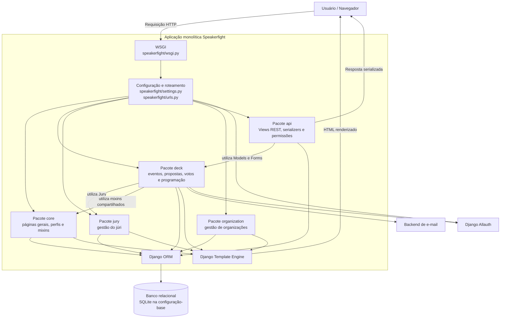
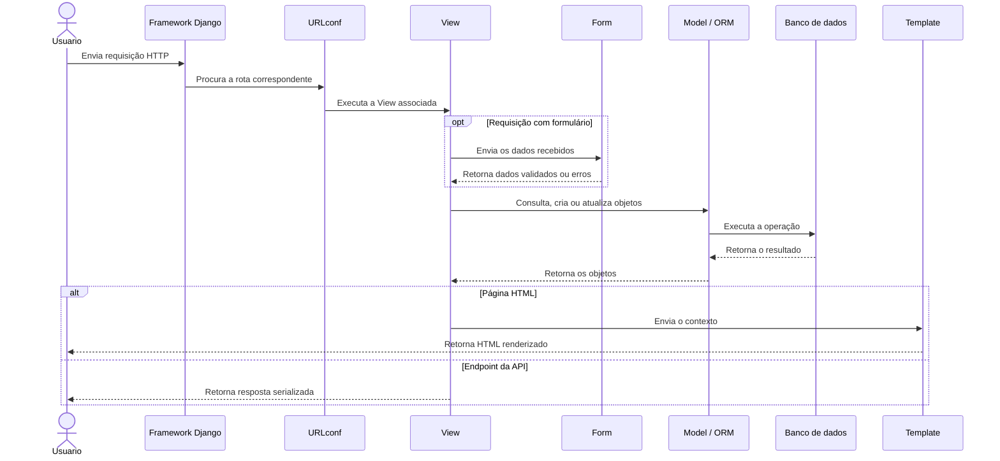
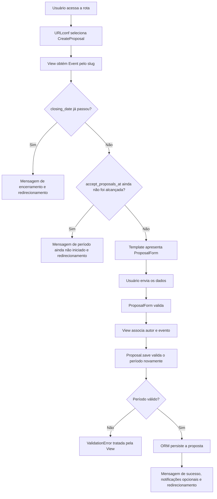

# Arquitetura do Speakerfight

## 1. Visão geral

O Speakerfight é uma aplicação web voltada à organização de eventos e à submissão de propostas de palestras. O sistema permite:

- criar, editar e excluir eventos;
- definir o período de recebimento de propostas;
- receber, editar e excluir propostas;
- organizar júris;
- votar, aprovar e reprovar propostas;
- montar e consultar a programação de um evento;
- exportar informações de votação;
- consultar e manipular parte da programação por meio de uma API REST.

A aplicação foi desenvolvida com Django e renderiza páginas HTML no servidor. O projeto também utiliza Django REST Framework para os endpoints da API.

---

## 2. Classificação arquitetural

A arquitetura do Speakerfight pode ser descrita em dois níveis:

| Aspecto analisado | Classificação |
|---|---|
| Execução e implantação do sistema | Arquitetura monolítica |
| Organização interna do código Django | Padrão MTV — Model, Template e View |

Essas classificações não são concorrentes. A arquitetura monolítica descreve como o sistema é executado e implantado. O padrão MTV descreve como as responsabilidades são organizadas internamente no projeto Django.

### 2.1 Arquitetura monolítica

Uma aplicação monolítica concentra suas funcionalidades em uma única unidade executável e implantável.

O Speakerfight é classificado como monolítico porque possui:

- um único projeto Django;
- um arquivo central de configurações;
- um roteamento principal;
- uma única aplicação WSGI;
- aplicações Django executadas em conjunto;
- um banco de dados compartilhado;
- dependências diretas entre diferentes aplicações internas.

No arquivo `speakerfight/settings.py`, as aplicações locais são registradas no mesmo `INSTALLED_APPS`:

```python
LOCAL_APPS = [
    'deck',
    'core',
    'jury',
    'api',
    'organization',
]

INSTALLED_APPS = LOCAL_APPS + THIRD_PARTY_APPS + DEFAULT_APPS
```

O mesmo arquivo define uma única configuração principal de rotas e uma única aplicação WSGI:

```python
ROOT_URLCONF = 'speakerfight.urls'
WSGI_APPLICATION = 'speakerfight.wsgi.application'
```

A configuração-base do repositório utiliza um único banco SQLite:

```python
DATABASES = {
    'default': {
        'ENGINE': 'django.db.backends.sqlite3',
        'NAME': 'db.sqlite3'
    }
}
```

O arquivo também permite sobrescrever configurações por meio de `local_settings.py`:

```python
try:
    from local_settings import *
except ImportError:
    pass
```

Isso significa que ambientes locais ou de implantação podem utilizar configurações diferentes, mas a aplicação continua compartilhando uma única configuração de banco por execução.

O arquivo `speakerfight/urls.py` reúne as rotas de todas as aplicações:

```python
urlpatterns = (
    url(r'^admin/', admin.site.urls),
    url(r'^accounts/', include('allauth.urls')),
    url(r'^', include('core.urls')),
    url(r'^', include('deck.urls')),
    url(r'^', include('jury.urls')),
    url(r'^organizations/', include('organization.urls')),
    url(r'^api/', include('api.urls')),
)
```

Portanto, `core`, `deck`, `jury`, `organization` e `api` não são serviços independentes. Todas essas partes pertencem à mesma aplicação Django, compartilham o mesmo processo e utilizam o mesmo banco de dados.

### 2.2 Padrão MTV do Django

O Django organiza a aplicação pelo padrão **MTV**, correspondente a:

- **Model**;
- **Template**;
- **View**.

Esse padrão é semelhante ao MVC tradicional, mas utiliza nomes diferentes para algumas responsabilidades.

| MVC tradicional | Django MTV | Responsabilidade principal |
|---|---|---|
| Model | Model | Dados, relacionamentos, persistência e regras associadas ao domínio |
| View | Template | Apresentação das informações ao usuário |
| Controller | View, URLconf e framework Django | Recebimento da requisição e coordenação do fluxo |

No Django, uma **View** não representa diretamente a página visual. A View é uma função ou classe Python que recebe uma requisição e retorna uma resposta.

O **Template** é o arquivo responsável pela estrutura de apresentação, geralmente escrito em HTML com a linguagem de templates do Django.

O papel associado ao Controller do MVC é dividido principalmente entre:

- o framework Django;
- os arquivos `urls.py`;
- as Views da aplicação.

---

## 3. Mapeamento do MTV no Speakerfight

### 3.1 Model

Os Models representam as entidades, os relacionamentos, a persistência e parte das regras de negócio.

O principal arquivo de Models analisado é:

```text
deck/models.py
```

Nele estão classes como:

```python
class Vote(models.Model):
class Activity(DeckBaseModel):
class Proposal(Activity):
class Track(models.Model):
class Event(DeckBaseModel):
```

Exemplos de responsabilidades dos Models:

- `Event` representa um evento e suas configurações;
- `Proposal` representa uma proposta submetida;
- `Activity` representa uma atividade da programação;
- `Track` organiza atividades em uma trilha;
- `Vote` registra a avaliação de um usuário para uma proposta.

A issue #304 adicionou ao Model `Event` o campo que armazena a data de abertura do período de submissão:

```python
accept_proposals_at = models.DateTimeField(
    null=True,
    blank=True
)
```

A issue #306 acrescentou ao Model `Event` a propriedade que informa se essa data ainda não foi alcançada:

```python
@property
def accept_proposals_at_not_reached(self):
    if not self.accept_proposals_at:
        return False
    return timezone.now() < self.accept_proposals_at
```

Quando `accept_proposals_at` está vazio, a propriedade retorna `False`. Dessa forma, eventos antigos, que não possuem uma data de abertura definida, mantêm o comportamento anterior.

Quando a data está preenchida, a propriedade retorna `True` enquanto o horário atual for anterior a `accept_proposals_at`.

O método `Proposal.save()` protege a criação de novas propostas nos dois limites do período de submissão:

```python
def save(self, *args, **kwargs):
    if not self.pk and self.event.closing_date_is_passed:
        raise ValidationError(
            _("This Event doesn't accept Proposals anymore."))

    if not self.pk and self.event.accept_proposals_at_not_reached:
        raise ValidationError(
            _("This Event doesn't accept Proposals yet."))

    return super(Proposal, self).save(*args, **kwargs)
```

A condição `not self.pk` indica que as verificações são aplicadas à criação de uma nova proposta. A atualização de uma proposta já existente não é bloqueada por essas duas condições.

Assim, uma nova proposta só pode ser persistida quando:

- a data de encerramento ainda não passou; e
- a data de abertura já foi alcançada ou não foi definida.

### 3.2 View

As Views recebem as requisições, consultam Models, processam formulários e determinam as respostas.

O principal arquivo de Views analisado é:

```text
deck/views.py
```

Nele estão classes como:

```python
class ListEvents(BaseEventView, ListView):
class CreateEvent(LoginRequiredMixin, BaseEventView, CreateView,
                  FormValidRedirectMixing):
class DetailEvent(BaseEventView, DetailView):
class CreateProposal(LoginRequiredMixin, BaseProposalView, CreateView,
                     FormValidRedirectMixing):
class UpdateProposal(LoginRequiredMixin, BaseProposalView, UpdateView,
                     FormValidRedirectMixing):
```

A classe `CreateProposal`:

- obtém o evento pelo `slug`;
- verifica se a data de encerramento já passou;
- verifica se a data de abertura ainda não foi alcançada;
- recebe e valida o `ProposalForm`;
- associa o usuário e o evento à proposta;
- solicita ao Model o salvamento da nova proposta;
- trata erros de integridade e validação;
- envia notificações quando essa funcionalidade está habilitada;
- redireciona o usuário.

O método `get()` protege o acesso à página de criação de proposta:

```python
def get(self, request, *args, **kwargs):
    data = self.get_context_data()
    event = data.get('event')

    if event.closing_date_is_passed:
        messages.error(
            self.request,
            _(u"This Event doesn't accept Proposals anymore."))
        return HttpResponseRedirect(
            reverse('view_event', kwargs={'slug': event.slug}),
        )

    if event.accept_proposals_at_not_reached:
        messages.error(
            self.request,
            _(u"This Event doesn't accept Proposals yet."))
        return HttpResponseRedirect(
            reverse('view_event', kwargs={'slug': event.slug}),
        )

    return super(CreateProposal, self).get(request, *args, **kwargs)
```

Assim, uma requisição GET realizada antes da abertura ou depois do encerramento é redirecionada para a página do evento.

Nas requisições POST, a proteção definitiva ocorre durante a execução de `Proposal.save()`, chamado pelo método `form_valid()`:

```text
POST
→ ProposalForm
→ CreateProposal.form_valid()
→ Proposal.save()
→ validação do período
```

Caso a regra seja violada, o Model lança `ValidationError`, que é tratada pela View.

Também existem Views da API em:

```text
api/views.py
```

Exemplos:

```python
class RetrieveEventScheduleView(generics.RetrieveAPIView):
class CreateActivityView(permissions.DeckPermissionMixing,
                         generics.CreateAPIView):
class ActivityView(permissions.DeckPermissionMixing,
                   generics.RetrieveAPIView,
                   generics.UpdateAPIView,
                   generics.DestroyAPIView):
```

Essas Views utilizam os mesmos Models e o mesmo banco do restante da aplicação.

### 3.3 Template

Os Templates definem como os dados são apresentados ao usuário.

Os principais Templates analisados estão em:

```text
deck/templates/
```

Exemplos:

```text
deck/templates/event/event_form.html
deck/templates/event/event_detail.html
deck/templates/event/my_events.html
deck/templates/proposal/proposal_form.html
```

O template `event/event_form.html` recebe o formulário preparado pela View e o renderiza:

```django
<form method="POST" novalidate>
    
    
</form>
```

O template `event/event_detail.html` recebe o evento e as propostas:

```django

    ...

```

Ele também controla a apresentação do botão de envio de proposta com base na data de encerramento:

```django

    <span class="pull-right text-danger">
        
    </span>

    <a href="">
        
    </a>

```

Na versão atual, esse Template verifica apenas se `closing_date` já passou. Ele ainda não utiliza `accept_proposals_at` para ocultar o botão antes da abertura.

Consequentemente, o link de envio pode continuar visível antes da data de abertura. Entretanto, ao acessá-lo, a View `CreateProposal` bloqueia a requisição GET e redireciona o usuário.

Além disso, uma tentativa de criação por POST é bloqueada por `Proposal.save()`. Portanto, o Template funciona apenas como camada de apresentação e não é utilizado como única proteção da regra.

O template `proposal/proposal_form.html` apresenta os campos do formulário de proposta:

```django



```

---

## 4. Elementos auxiliares ao MTV

### 4.1 URLconf

Os arquivos `urls.py` associam cada endereço a uma View.

Exemplo em `deck/urls.py`:

```python
url(
    regex=r'/events/<slug:slug>/proposals/create/',
    view=views.CreateProposal.as_view(),
    name='create_event_proposal'
)
```

O arquivo `deck/urls.py` importa `surl` do pacote `smarturls` com o nome `url`. Por isso, a expressão `<slug:slug>` é interpretada pelo `smarturls`, e não pelo mecanismo nativo de conversores de rota das versões mais recentes do Django.

Quando o usuário acessa essa rota, o Django executa a View `CreateProposal`.

### 4.2 Forms

Os Forms recebem e validam os dados informados pelo usuário.

O arquivo principal analisado é:

```text
deck/forms.py
```

Exemplos:

```python
class EventForm(forms.ModelForm):
class ProposalForm(forms.ModelForm):
class ActivityForm(forms.ModelForm):
class ActivityTimetableForm(forms.ModelForm):
```

Os Forms não compõem a sigla MTV, mas auxiliam as Views na validação e na conversão dos dados enviados pelos Templates.

O `EventForm` utiliza `exclude = ['author', 'jury']`. Como `accept_proposals_at` não está nessa lista, o campo é incluído automaticamente no `ModelForm`. O Template `event/event_form.html` renderiza o formulário com ``, permitindo que a data de abertura seja informada na criação ou edição do evento. O campo `closing_date` possui um widget personalizado, enquanto `accept_proposals_at` utiliza o widget padrão gerado pelo Django.

### 4.3 Serializers

Os Serializers são utilizados pela API REST para converter e validar dados.

As Views de `api/views.py` utilizam serializers para representar eventos e atividades nas respostas da API.

---

## 5. Principais aplicações Django

### 5.1 `speakerfight`

Responsável pela configuração global:

- `settings.py`;
- `urls.py`;
- configuração WSGI;
- banco de dados;
- internacionalização;
- aplicações instaladas;
- autenticação;
- templates;
- arquivos estáticos e de mídia.

### 5.2 `deck`

É a principal aplicação de negócio.

Concentra:

- eventos;
- propostas;
- votos;
- atividades;
- trilhas;
- formulários;
- Views;
- Templates;
- migrations;
- testes;
- geração e exportação da programação.

### 5.3 `core`

Concentra funcionalidades gerais e compartilhadas da aplicação, como páginas gerais, perfis e componentes reutilizados por outras aplicações.

### 5.4 `jury`

Responsável pelo gerenciamento do júri dos eventos.

O Model `Event` possui uma relação um-para-um com `Jury`.

### 5.5 `organization`

Responsável pelas funcionalidades relacionadas às organizações cadastradas no sistema.

### 5.6 `api`

Expõe endpoints REST para:

- consultar a programação de um evento;
- criar atividades;
- consultar atividades;
- atualizar atividades;
- excluir atividades.

A API utiliza os mesmos Models e o mesmo banco do restante da aplicação.

---

## 6. Principais entidades

| Entidade | Responsabilidade |
|---|---|
| `User` | Representa o usuário autenticado pelo Django |
| `Profile` | Armazena dados complementares do usuário |
| `Event` | Representa um evento e suas configurações |
| `Proposal` | Representa uma proposta submetida para um evento |
| `Activity` | Representa uma atividade da programação |
| `Track` | Organiza atividades em uma trilha |
| `Vote` | Registra a avaliação de uma proposta por um usuário |
| `Jury` | Agrupa os usuários responsáveis pela avaliação |
| `Organization` | Representa uma organização cadastrada |

---

## 7. Diagrama de componentes e pacotes

O diagrama abaixo representa os principais pacotes da aplicação e suas dependências diretas identificadas no código.



Esse diagrama não representa `core`, `deck`, `jury`, `organization` e `api` como serviços separados. Eles são pacotes internos da mesma aplicação Django, compartilham o mesmo processo e o mesmo banco de dados.

---

## 8. Fluxo de uma requisição no padrão MTV



---

## 9. Exemplo real: criação de uma proposta

O fluxo de criação de proposta envolve os seguintes arquivos:

```text
speakerfight/urls.py
deck/urls.py
deck/views.py
deck/forms.py
deck/models.py
deck/templates/proposal/proposal_form.html
```

Fluxo:

1. o usuário acessa a rota de criação de proposta;
2. `speakerfight/urls.py` inclui as rotas de `deck`;
3. `deck/urls.py` associa a rota à View `CreateProposal`;
4. `CreateProposal` obtém o evento pelo `slug`;
5. a View verifica se `closing_date` já passou;
6. a View verifica se `accept_proposals_at` ainda não foi alcançada;
7. se o período não estiver válido, o usuário recebe uma mensagem e é redirecionado;
8. se o período estiver válido, o Template `proposal/proposal_form.html` apresenta o formulário;
9. `ProposalForm` valida os dados enviados;
10. a View associa o autor e o evento;
11. `Proposal.save()` valida novamente o período de submissão;
12. o Django ORM persiste a proposta no banco;
13. a View registra a mensagem de sucesso e, se configurado, envia notificações;
14. o usuário é redirecionado para a página do evento.



---

## 10. Relação com as issues selecionadas

### 10.1 Issue #304

A issue #304 adicionou ao Model `Event` o campo:

```python
accept_proposals_at = models.DateTimeField(
    null=True,
    blank=True
)
```

Esse campo armazena a data de início do recebimento de propostas.

A alteração afetou principalmente:

- Model;
- migration;
- esquema do banco;
- testes de integridade do Model.

A migration criada foi:

```text
deck/migrations/0020_add_accept_proposals_at.py
```

Como o campo permite `null` e `blank`, eventos já existentes continuam compatíveis.

### 10.2 Issue #306

A issue #306 utiliza o campo `accept_proposals_at`, adicionado pela issue #304, para bloquear a criação de propostas antes do início do período de submissão.

A implementação adicionou ao Model `Event` a propriedade:

```python
@property
def accept_proposals_at_not_reached(self):
    if not self.accept_proposals_at:
        return False
    return timezone.now() < self.accept_proposals_at
```

A regra considera quatro situações:

```text
accept_proposals_at não definido
    → mantém o comportamento anterior

data atual < accept_proposals_at
    → submissão bloqueada

accept_proposals_at <= data atual <= closing_date
    → submissão permitida

data atual > closing_date
    → submissão bloqueada
```

A proteção foi aplicada em duas camadas:

- `CreateProposal.get()` impede o acesso à página antes da abertura ou depois do encerramento;
- `Proposal.save()` impede que uma nova proposta seja persistida fora do período válido.

A validação no Model protege o sistema mesmo quando a criação não ocorre diretamente pelo fluxo GET normal da interface.

A issue #306 não criou uma nova migration, pois reutiliza o campo adicionado pela migration da issue #304. Suas alterações ficaram concentradas na regra de domínio, na View e nos testes.

A implementação foi validada com os seguintes testes novos:

- `test_accept_proposals_at_not_reached_is_false_when_field_is_empty`;
- `test_accept_proposals_at_not_reached_is_true_before_the_date`;
- `test_accept_proposals_at_not_reached_is_false_after_the_date`;
- `test_event_create_event_proposal_before_accept_proposals_at`.

Os três primeiros verificam a propriedade do Model `Event`.

O teste funcional verifica que:

- uma requisição POST antes da abertura não cria a proposta;
- a mensagem de período ainda não iniciado é apresentada;
- uma requisição GET antes da abertura é redirecionada.

Após a integração das issues #304 e #306, a suíte completa executou **238 testes com sucesso**.

---

## 11. Persistência

O projeto utiliza o Django ORM para consultar e persistir dados.

A configuração-base utiliza SQLite:

```text
db.sqlite3
```

As migrations registram a evolução do esquema do banco.

Para a issue #304 foi criada a migration:

```text
deck/migrations/0020_add_accept_proposals_at.py
```

A issue #306 não alterou o esquema do banco de dados e, por isso, não exigiu uma nova migration.

A nova regra é aplicada durante a tentativa de criação de uma `Proposal`. Antes de executar o salvamento no banco, `Proposal.save()` consulta as propriedades do evento e pode lançar `ValidationError`.

Assim, uma nova proposta somente é persistida quando:

- a data de encerramento ainda não passou; e
- a data de abertura já foi alcançada ou não foi definida.

Como o campo `accept_proposals_at` permite `null`, eventos antigos continuam aceitando propostas segundo a regra anterior, limitada pela data de encerramento.

---

## 12. Contexto tecnológico

| Tecnologia | Utilização |
|---|---|
| Django 1.11.12 | Framework web principal |
| Django REST Framework 3.8.2 | Implementação da API REST |
| SQLite | Banco padrão da configuração-base |
| Django ORM | Persistência e consultas |
| Django Templates | Renderização das páginas HTML |
| Django Forms | Entrada e validação de dados |
| Django Allauth | Autenticação e login social |
| Coverage 4.5.1 | Cobertura da suíte de testes |
| Python 2.7 | Ambiente utilizado para executar o projeto legado |

---

## 13. Observações arquiteturais

A separação em aplicações Django ajuda na organização do código, mas não transforma essas aplicações em serviços independentes.

Também foram observadas classes que acumulam diferentes responsabilidades.

`CreateProposal`, por exemplo, participa de:

- consulta do evento;
- verificação da data de encerramento;
- verificação da data de abertura;
- processamento do formulário;
- persistência;
- tratamento de exceções;
- mensagens;
- notificações por e-mail;
- redirecionamento.

A implementação da issue #306 distribui a regra entre a View e o Model.

A View oferece uma resposta adequada ao usuário durante a requisição GET, com mensagem e redirecionamento. O Model protege a persistência de novas propostas e impede que a regra dependa exclusivamente da interface.

Essa distribuição não representa duas regras diferentes. As propriedades de `Event` centralizam a decisão temporal, enquanto a View e o Model utilizam essas informações em momentos diferentes do fluxo.

Também existe duplicação de estruturas de autorização e resposta entre Views como `RateProposal`, `ApproveProposal` e `DisapproveProposal`. Esses pontos serão detalhados em:

```text
documentacao/padroes_e_smells.md
```

---

## 14. Conclusão

O Speakerfight possui uma **arquitetura monolítica** porque todas as funcionalidades são executadas e implantadas como uma única aplicação Django, compartilhando configurações, roteamento, aplicação WSGI e banco de dados.

Internamente, o projeto segue o padrão **MTV — Model, Template e View**:

- os Models representam os dados e parte das regras de domínio;
- os Templates definem como os dados são apresentados;
- as Views recebem e processam as requisições;
- os arquivos `urls.py` ligam as rotas às Views;
- o framework Django coordena o ciclo da requisição.

As issues #304 e #306 demonstram essa distribuição de responsabilidades:

- o Model `Event` representa o estado temporal do evento;
- `Proposal.save()` protege a regra de persistência;
- a View `CreateProposal` controla a resposta apresentada ao usuário;
- o Template permanece como camada de apresentação e não é utilizado como única proteção.

Essa organização impede que uma restrição apenas visual seja contornada por uma requisição direta e preserva o comportamento de eventos antigos quando a data de abertura não está definida.

---

## 15. Arquivos analisados

- `speakerfight/settings.py`
- `speakerfight/urls.py`
- `deck/models.py`
- `deck/forms.py`
- `deck/views.py`
- `deck/urls.py`
- `deck/templates/event/event_form.html`
- `deck/templates/event/event_detail.html`
- `deck/templates/event/my_events.html`
- `deck/templates/proposal/proposal_form.html`
- `deck/tests/test_unit.py`
- `deck/tests/test_models.py`
- `deck/tests/test_functional.py`
- `deck/migrations/0020_add_accept_proposals_at.py`
- `api/views.py`
- `api/urls.py`
- `requirements.txt`
- `circle.yml`

---

## 16. Referências

> As referências do Django foram alinhadas à versão 1.11, utilizada pelo Speakerfight. Essa versão está arquivada e não recebe mais suporte de segurança.

- DJANGO SOFTWARE FOUNDATION. **FAQ: General — Django appears to be an MVC framework, but you call the Controller the “view”, and the View the “template”.**  
  <https://docs.djangoproject.com/en/1.11/faq/general/>

- DJANGO SOFTWARE FOUNDATION. **Models.**  
  <https://docs.djangoproject.com/en/1.11/topics/db/models/>

- DJANGO SOFTWARE FOUNDATION. **Writing views.**  
  <https://docs.djangoproject.com/en/1.11/topics/http/views/>

- DJANGO SOFTWARE FOUNDATION. **Templates.**  
  <https://docs.djangoproject.com/en/1.11/topics/templates/>

- AMAZON WEB SERVICES. **Monolithic vs. Microservices Architecture.**  
  <https://aws.amazon.com/pt/compare/the-difference-between-monolithic-and-microservices-architecture/>
